# Overview:
* `apps/sampleapp.py`: Store logic for handle API RESTful, state management for Tracker, box to peer
* `start_sampleapp.py`: Using like a command parse (parse the command you type on terminal) + Prepare and launch the RESTful application

## Authentication

| Field        | Value                                                                         |
| ------------ | ----------------------------------------------------------------------------- |
| Endpoint     | `/login`                                                                      |
| Method       | POST                                                                          |
| Description  | Login (simulator)                                                             |
| Request Body | `{ "username": "Alice" }`                                                     |
| Response     | `{ "status": "success", "message": "Welcome Alice", "token": "dummy_token" }` |

---

## Peer Management

| Field        | Value                                                                   |
| ------------ | ----------------------------------------------------------------------- |
| Endpoint     | `/submit-info`                                                          |
| Method       | POST                                                                    |
| Description  | sign up IP/Port for peer                                                |
| Request Body | `{ "username": "Alice", "ip": "192.168.1.10", "port": 5000 }`           |
| Success      | `{ "status": "success", "message": "IP/Port registration successful" }` |
| Error        | `{ "status": "error", "message": "Missing username, IP, or port" }`     |

---

| Field        | Value                                     |
| ------------ | ----------------------------------------- |
| Endpoint     | `/get-list`                               |
| Method       | GET                                       |
| Description  | Get peer list                        |
| Request Body | None                                      |
| Response     | `{ "status": "success", "peers": {...} }` |

---

##  Channel Management

| Field        | Value                                                                  |
| ------------ | ---------------------------------------------------------------------- |
| Endpoint     | `/add-list`                                                            |
| Method       | POST                                                                   |
| Description  | Create channel                                                         |
| Request Body | `{ "channel_name": "general" }`                                        |
| Success      | `{ "status": "success", "message": "Channel created" }`                |
| Error        | `{ "status": "error", "message": "Invalid or existing channel name" }` |

---

##  Peer-to-Peer Communication

| Field        | Value                                               |
| ------------ | --------------------------------------------------- |
| Endpoint     | `/connect-peer`                                     |
| Method       | POST                                                |
| Description  | Handshake between peer                              |
| Request Body | `{ "username": "Alice" }`                           |
| Response     | `{ "status": "success", "message": "Hi Alice..." }` |

---

| Field        | Value                                                        |
| ------------ | ------------------------------------------------------------ |
| Endpoint     | `/send-peer`                                                 |
| Method       | POST                                                         |
| Description  | Send message P2P                                             |
| Request Body | `{ "sender": "Alice", "message": "Hello" }`                  |
| Response     | `{ "status": "success", "message": "P2P message received" }` |

---

##  Broadcast Messaging

| Field        | Value                                                                      |
| ------------ | -------------------------------------------------------------------------- |
| Endpoint     | `/broadcast-peer`                                                          |
| Method       | POST                                                                       |
| Description  | Send message to channel                                                    |
| Request Body | `{ "sender": "Alice", "channel": "general", "message": "Hello everyone" }` |
| Success      | `{ "status": "success", "message": "Broadcast message received" }`         |
| Error        | `{ "status": "error", "message": "Channel does not exist" }`               |

---


# How to run: 
```bash
cd Computer_Network-HCMUT-PO/ass1/CO3094-asynaprous
```
Run this command in terminal
```bash
python start_sampleapp.py [--server-ip <ip>] [--server-port <port>]
```
- Terminal 
```bash
python start_sampleapp.py --server-port 2026
```


If no arguments are provided, the application will use the following defaults:
* **IP Address:** `--server-ip` defaults to `0.0.0.0`
* **Port:** `--server-port` defaults to `2026`

# Test
Using Postman (download app) because in this assignment we use 127.0.0.1 so we must test in localhost. For add-list and broadcast-peer you must config your Username and Password in `httpadapter.py`

    - Username: admin

    - Password: 123456
## Authorization
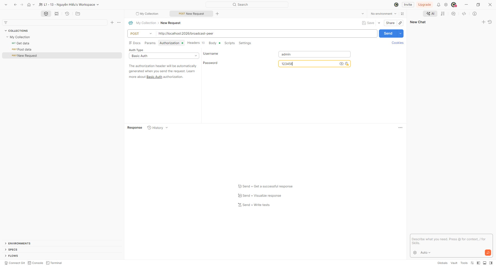

## Login

## Send-peer

## Add-list
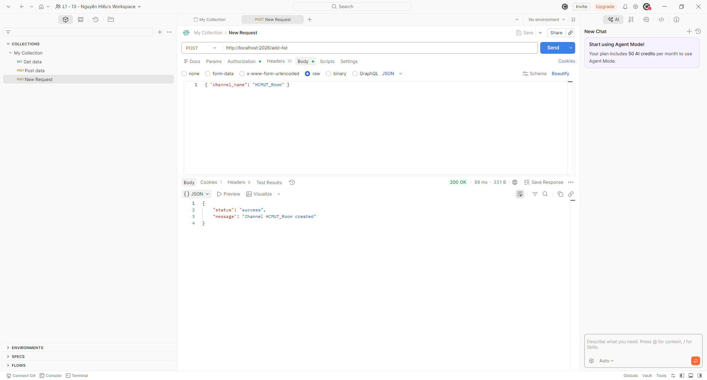
## Connect-peer

## Get-list
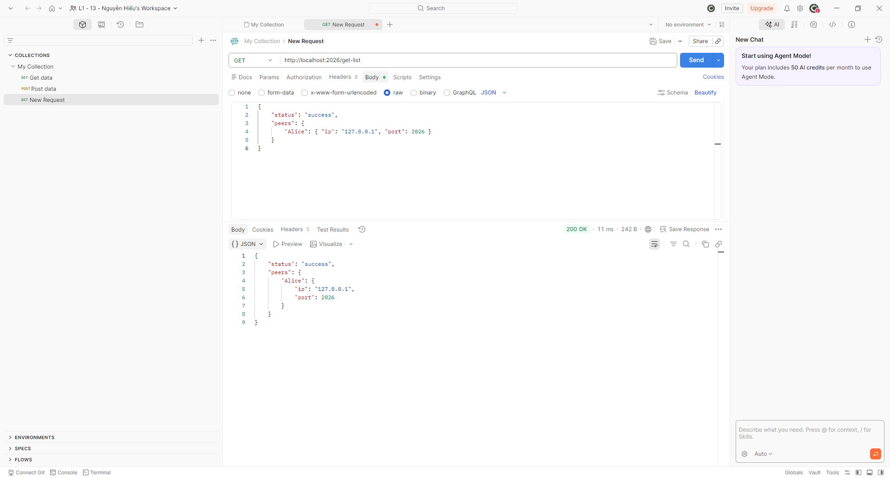
## Submit-info
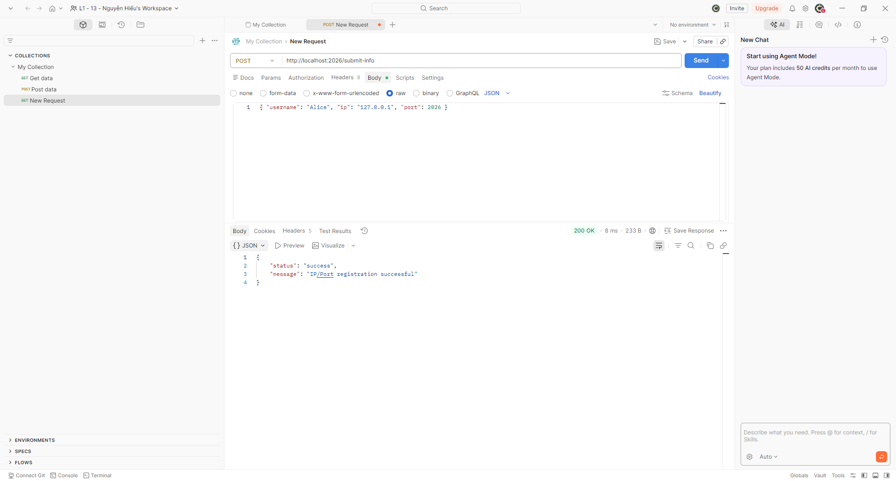
## Broadcast-peer


#Test P2P

## Register Alice and Bob to Tracker (CLient-Server Phase)
## Alice
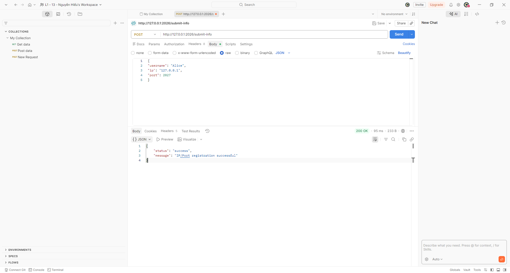
## Bob
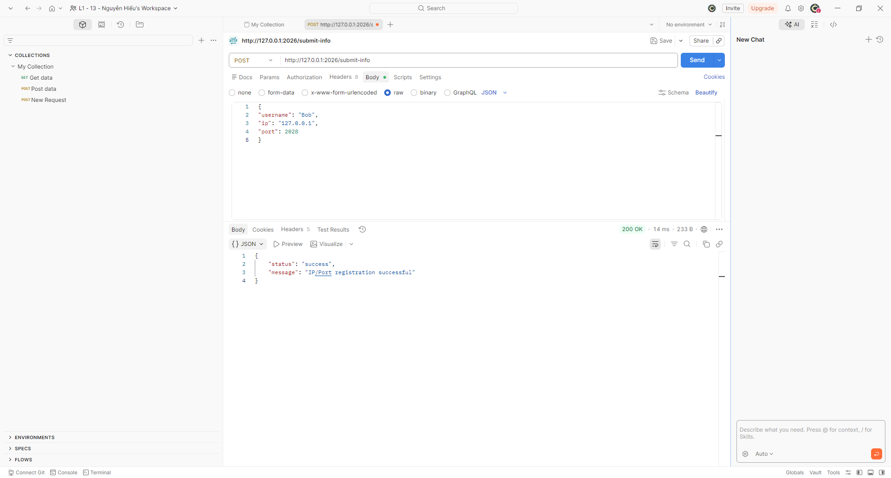
## Check peer list on Tracker
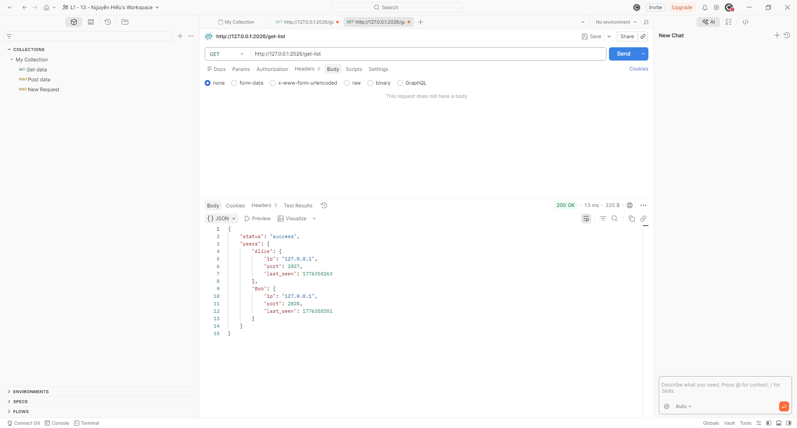
## Handshake P2P (Alice connect to Bob)
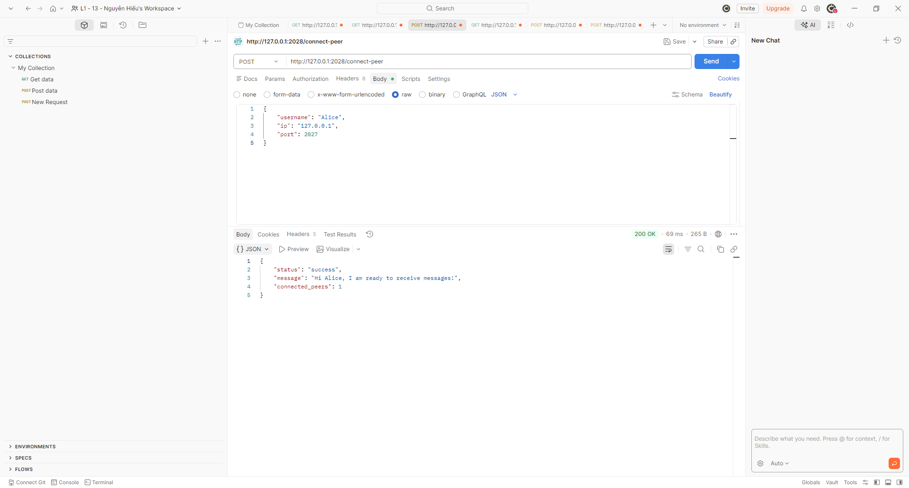
## Check Bob connect
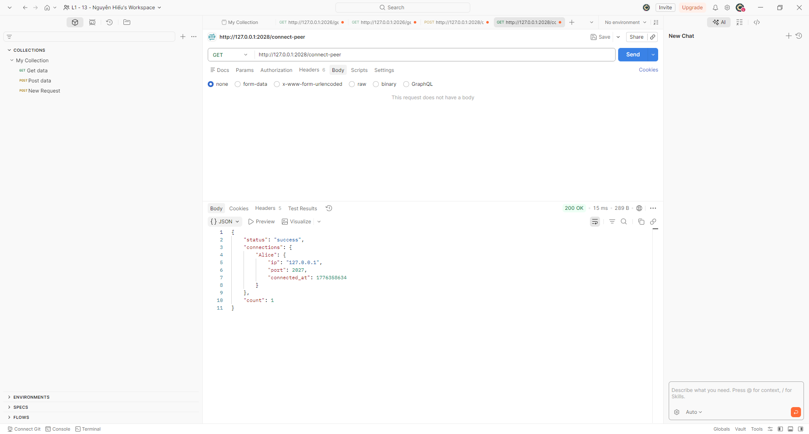
## Send P2P message (Alice -> Bob)
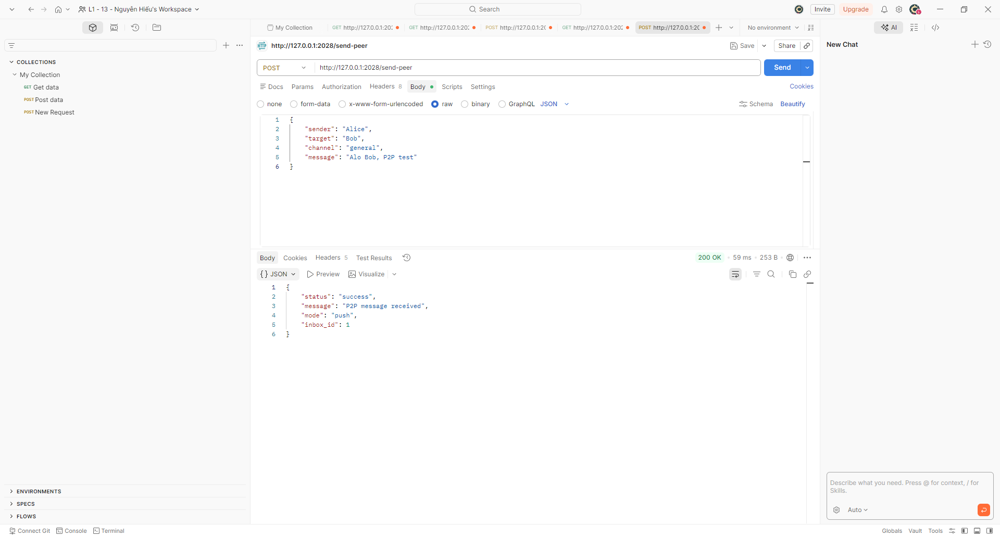
## Bob Pull
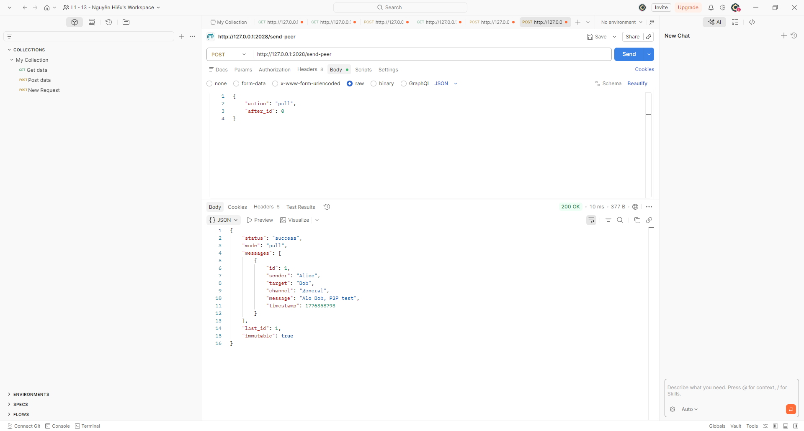
## Pull Incremental 
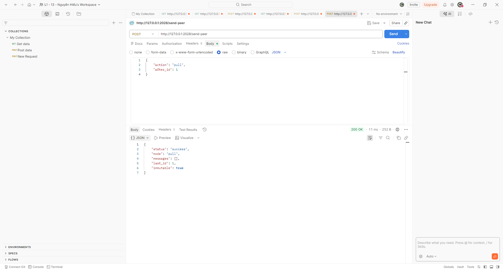